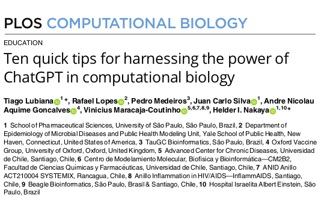
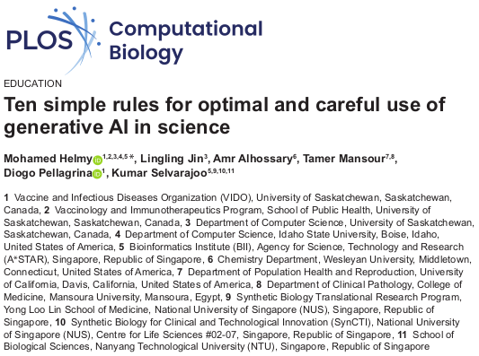

O segundo encontro de 2026 do Seminário de Afinidades em Genômica e Bioinformática (SAGB), se realizará no dia 21 de outubro de 2026 as 10h, no [Anfiteatro Epaminondas S. B. Ferraz da central de aulas (prédio 11)](http://www.cena.usp.br/images/croqui_cena.pdf) do [Centro de Energia Nuclear na Agricultura (CENA)](https://goo.gl/maps/FrKPachXUcgeNt7j8) da Universidade de São Paulo (USP). Neste encontro discutiremos sobre o tema "Bioinformática na selva da IA: um guia de sobrevivência", e os seguintes artigos podem ser usados omo material para apoiar a discusão [Ten quick tips for harnessing the power of ChatGPT in computational biology](https://doi.org/10.1371/journal.pcbi.1011319) e [Ten simple rules for optimal and careful use of generative AI in science](https://doi.org/10.1371/journal.pcbi.1013588).

Todos os membros do campus (alunos, pesquisadores, funcionarios e docentes) estão convidados para participar ativamente da discucão, por isso recomendamos ler previamente os artigos.

Se tiver interesse em participar por gentileza preencher o formulário:

<iframe src="https://docs.google.com/forms/d/e/1FAIpQLSdZd8i0PWfHw9XlmNakbmkmnA_xphPtiQrO13zy2gRzjSLQWA/viewform?embedded=true" width="640" height="1252" frameborder="0" marginheight="0" marginwidth="0">Carregando…</iframe>

O SAGB é um evento de integração no campus Luiz de Queiroz da Univesidade de São Paulo organizado conjuntamente por professores e pesquisadores das duas unidades do campus: ESALQ e CENA.
