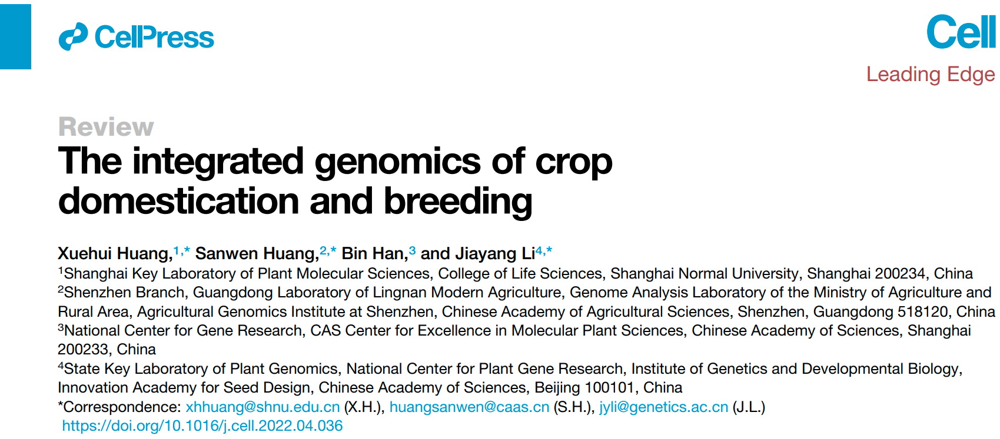

O segundo encontro do Seminário de Afinidades em Genômica e Bioinformática (SAGB), se realizará no dia 28 de junho de 2023 as 10h, no [Anfiteatro do Departamento de Genética - Edifício "Prof. José Theófilo do Amaral Gurgel" (Prédio 14)](https://www.esalq.usp.br/acom/mapa/mapa.htm) da [Escola Superior de Agricultura Luiz de Queiroz (ESALQ)](https://goo.gl/maps/a6EAUzQEy3E59iyP8) da Universidade de São Paulo (USP). Neste segundo encontro discutiremos o artigo ["The integrated genomics of crop domestication and breeding"](https://www.cell.com/cell/fulltext/S0092-8674(22)00534-7).

Todos os membros do campus (alunos, pesquisadores, funcionarios e docentes) estão convidados para participar ativamente da discucão, por isso recomendamos ler previamente o artigo.

Se tiver interesse em participar por gentileza preencher o formulário:

<iframe src="https://docs.google.com/forms/d/e/1FAIpQLSdZd8i0PWfHw9XlmNakbmkmnA_xphPtiQrO13zy2gRzjSLQWA/viewform?embedded=true" width="640" height="1252" frameborder="0" marginheight="0" marginwidth="0">Carregando…</iframe>

O SAGB é um evento de integração no campus Luiz de Queiroz da Univesidade de São Paulo organizado conjuntamente por professores e pesquisadores das duas unidades do campus: ESALQ e CENA.
