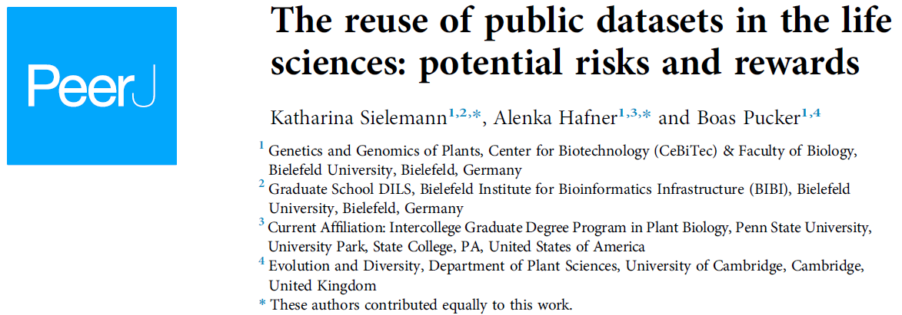

No nosso segundo ano do [SAGB](https://labbces.netlify.app/project/sagb/), o terceiro encontro em 2024, se realizará no dia 28 de agosto de 2023 as 10h, na [Sala Beata da central de aulas (prédio 11)](http://www.cena.usp.br/images/croqui_cena.pdf) do [Centro de Energia Nuclear na Agricultura (CENA)](https://goo.gl/maps/FrKPachXUcgeNt7j8) da Universidade de São Paulo (USP). Neste encontro discutiremos o artigo ["The reuse of public datasets in the life sciences: potential risks and rewards"](https://peerj.com/articles/9954/).

Todos os membros do campus (alunos, pesquisadores, funcionarios e docentes) estão convidados para participar ativamente da discucão, por isso recomendamos ler previamente o artigo.

Se tiver interesse em participar por gentileza preencher o formulário:

<iframe src="https://docs.google.com/forms/d/e/1FAIpQLSdZd8i0PWfHw9XlmNakbmkmnA_xphPtiQrO13zy2gRzjSLQWA/viewform?embedded=true" width="640" height="1252" frameborder="0" marginheight="0" marginwidth="0">Carregando…</iframe>

O SAGB é um evento de integração no campus Luiz de Queiroz da Univesidade de São Paulo organizado conjuntamente por professores e pesquisadores das duas unidades do campus: ESALQ e CENA.
