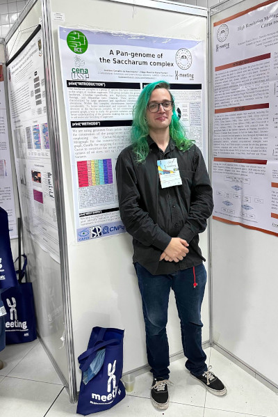
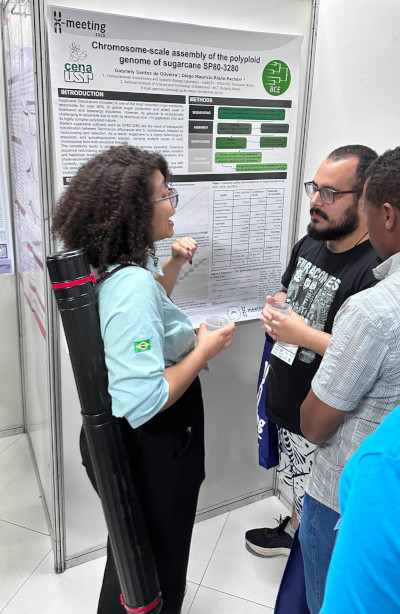
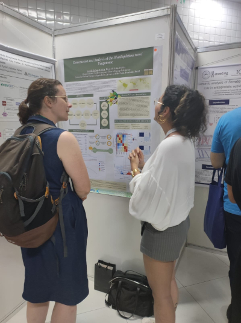
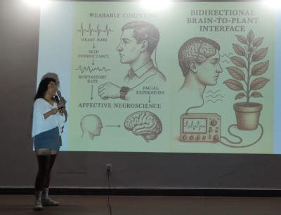

# XMeeting 2025

Three of our students are participating in the XMeeting, 2025 that takes place in João Pessoa, PB, this week (2nd to 6th of June).

- [Gustavo C. do Nascimento](/author/gustavo-carvalho-do-nascimento/), presented his results {}A Pan-genome of the Saccharum complex{}, part of his research as Master student in PPG/Ciências at CENA/USP.

- [Gabriely Santos de Oliveira](/author/gabriely-santos-de-oliveira/), presented her results {}Chromosome-scale assembly of the polyploid genome of sugarcane SP80-3280{}, part of his research as Master student in PPG/Ciências at CENA/USP.

- [Isabella Gallego Rendón](/author/isabella-gallego-rendon/), presented her first results {}Construction and Analysis of the Moniliophthora roreri Pangenome{}, part of his research as Master student in PPG/Ciências at CENA/USP.

Also, Isabella Gallego Rendón, together with former members of LabBCES: Jorge Mario Muñoz-Perez and Felipe Vaz Peres, participated in the final of the [Liga Brasileira de Bioinformática](https://lbb.rsg-brazil.com/), with their project: "Biointerface Cérebro-Planta: Integracão de EEG humano com resposta gênica fotoinduzida".

