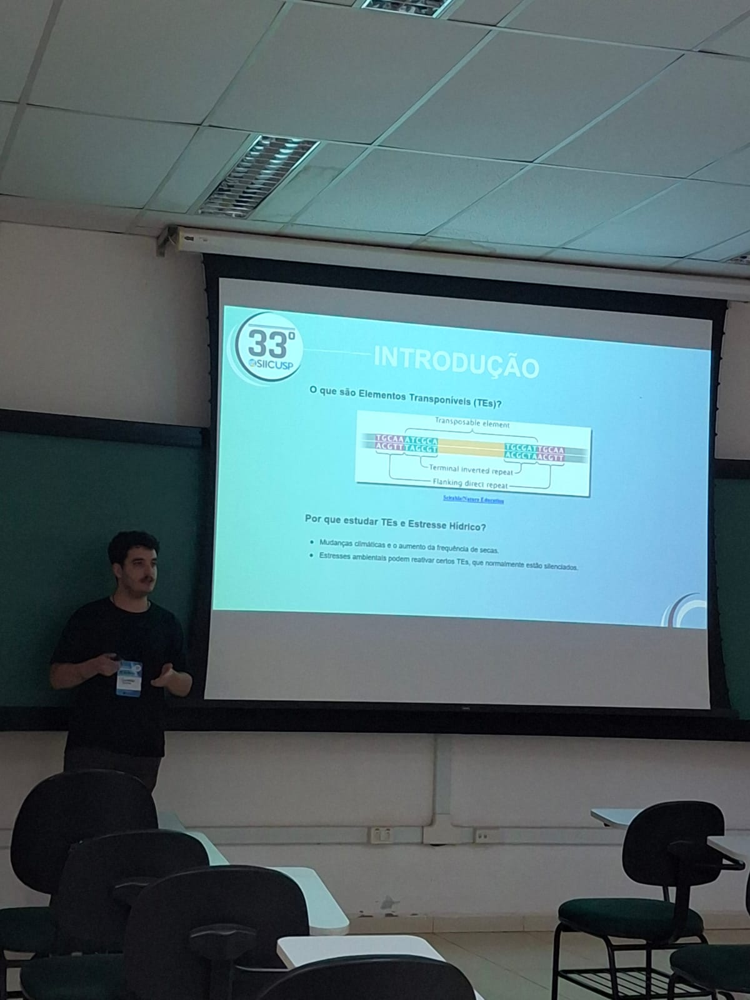

# SIICUSP 33rd

Every year we have the International Symposion of Scientific Iniciation at USP, where undergrads involved in research project can show their results. In this year edition we had one member of the group presenting his research: Gustavo Lelli Guirao, presenting his advances in the project "{}Identificação de TEs Expressos Especificamente em Estresse Hídrico em Gramíneas C4{}".

