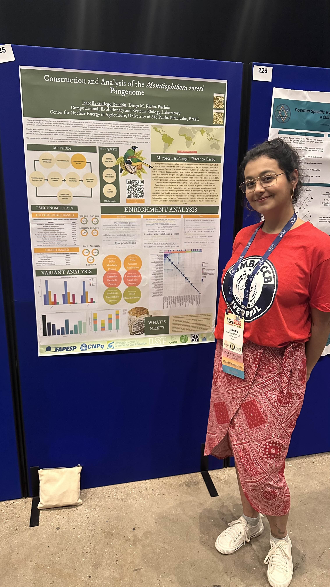
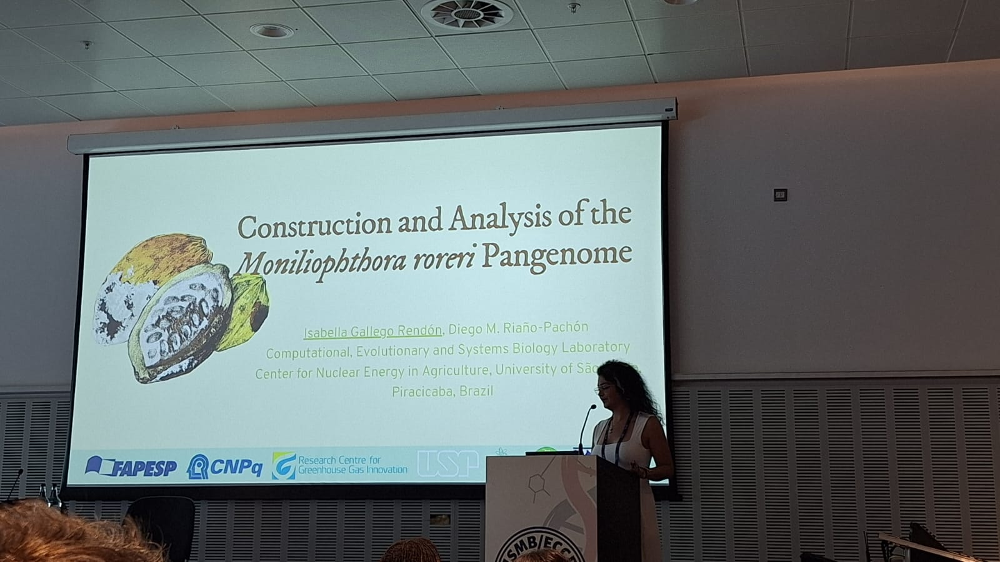
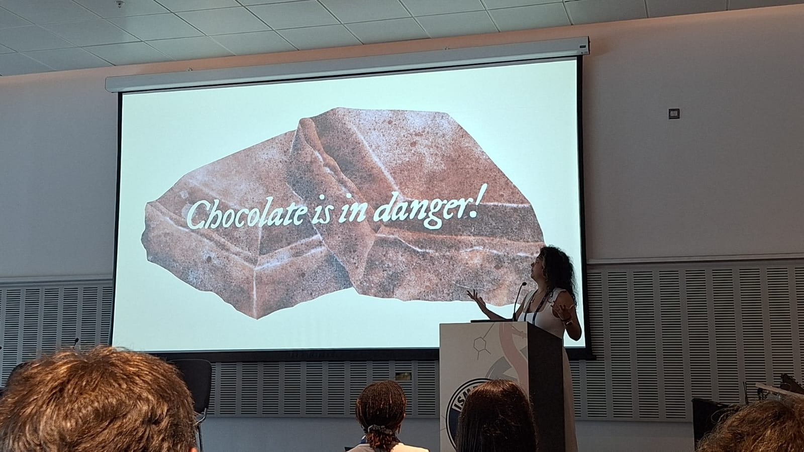

# ISMB/ECCB 2025

One of our students, [Isabella Gallego Rendón](/author/isabella-gallego-rendon/), participated in the joint meeting: Intelligent Systems for Molecular Biology (ISMB) / European Conference on Computational Biology (ECCB), that took place in Liverpool, United Kingdom, between July 20th and 24th. She presented part of her master dissertation results about the {}*Moniliophthora roreri* pangenome{}.

