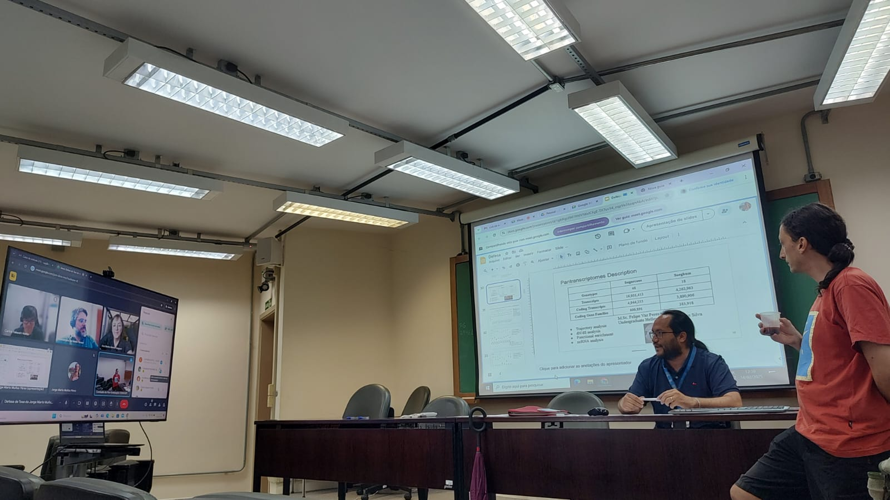

# February 2025 - Defense PhD Project Mr. Jorge Mario Muñoz Perez

Mr. Jorge successfully defended his PhD’s project, entitled “Inferência e análise de redes de co-expressão gênica em cana-de-açúcar e sorgo”, on February 14th, 2025. The members of his assessment committee were Prof. Carlos Hotta (IQ/USP), Prof. Alessandro Varani (UNESP) and Prof. Ana Maria Benko Iseppon (UFPE).
