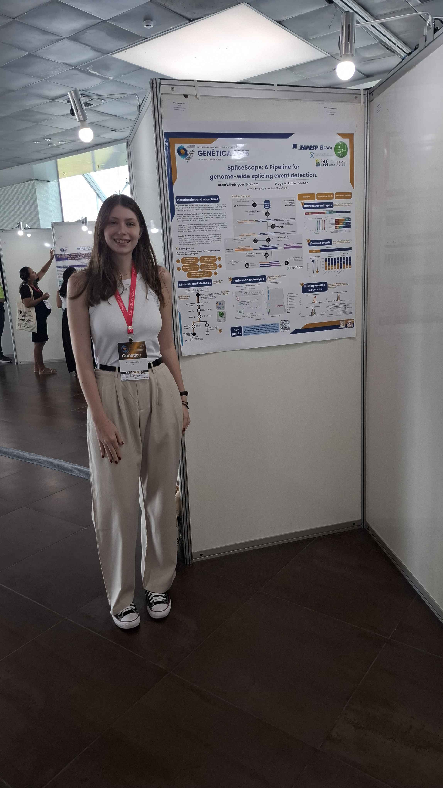
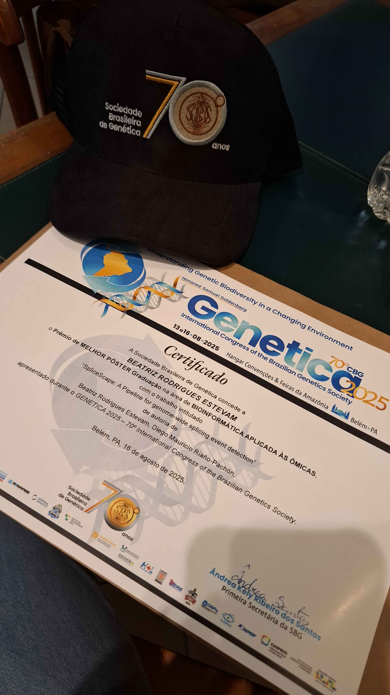

Between August 13th and 16th, 2025, at Belém (Pará), The Brazilian Society for Gentics hosted the [Brazilian Congress of Genetics – Genética 2025](https://sbg.org.br/eventos/genetica/apresentacao), one of the country’s most important scientific meetings in the field. Our undergraduate student [Beatriz Rodrigues Estevam](/author/beatriz-rodrigues-estevam/), who has been part of the LabBCES (CENA/USP) since 2020, proudly represented the group with the presentation of her [FAPESP-funded research project](https://bv.fapesp.br/pt/bolsas/205267/selecao-in-silico-de-introns-de-cana-de-acucar-com-potencial-para-melhorar-o-processo-de-edicao-de-g/).

Beatriz presented the development of [SpliceScape](https://github.com/labbces/spliceScape), a bioinformatics pipeline designed to identify splice events in plants ({}PDF{}). Her work drew great attention in the category Bioinformatics Applied to Omics for Undergraduate Research, where she was awarded the Best Poster Prize.

This recognition is a remarkable milestone in Beatriz’s academic journey. Soon, she will embark on a [three-month research internship at the Sanger Institute (UK)](/post/10-02-2025-sangerprize_bre/), further expanding her expertise and international experience. She is expected to return in December to complete her FAPESP-funded project and defend her graduation thesis in Biology at [ESALQ/USP](https://www.esalq.usp.br/).

We are proud to see Beatriz’s dedication and achievements being recognized nationally and internationally. Congratulations, Beatriz!

