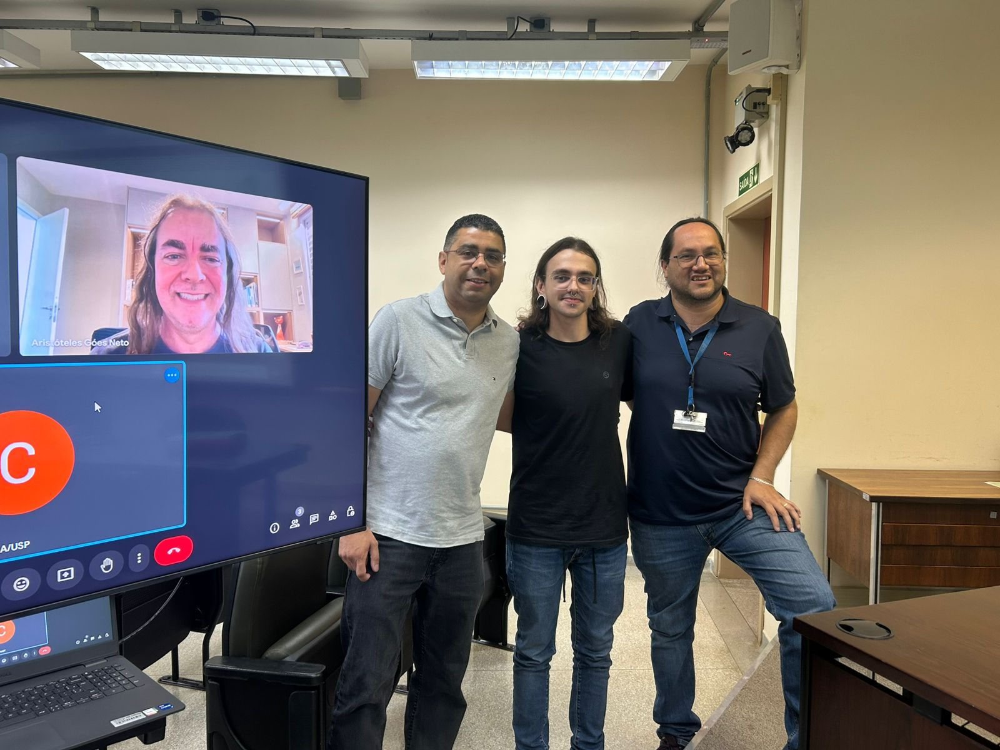

# February 2025i - Defense Master Project Mr. Felipe Vaz Peres

Mr. Felipe successfully defended his master’s project, entitled “Análise multi-genótipo de RNAs longos nnão codificantes em cana-de-açúcar”, on February 21st, 2025. The members of his assessment committee were Prof. Douglas Silva Domingues (ESALQ/USP) and Prof. Aristóteles Góes Neto (UFMG).
