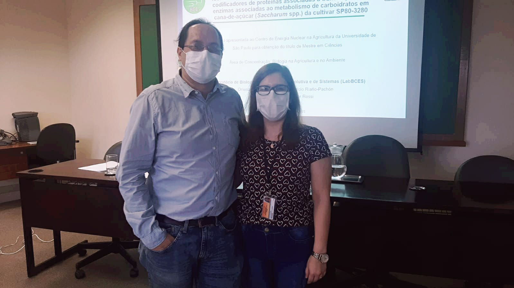

# August 2022 - Defense Master Project Mrs. Versuca Semmler Rossi

Mrs. Verusca successfully defended her master's project, entitled "Identificação e análise de co-expressão in sílico de genes codificadores de proteínas associadas a transcrição e de enzimas associadas ao metabolismo de carboidratos em cana-de-açúcar (Saccharum spp.) da cultivar SP80-3280", on August 5th, 2022. The members of her assessment committee were Prof. Claudia Vitorello and Prof. Igor Cesarino.

# August 2023 - Defense Master Project Mrs. Isabella de Oliveira Conte Poletto

Mrs. Isabella successfully defended her master's project entitled "Caracterização molecular de genes endógenos no genoma da cana-de-açúcar por captura e sequenciamento de DNA de terceira geração" on August 18th, 2023. The members of her assessment committee were Prof. Helaine Carrer and Prof. Maria Imaculada Zucchi.
